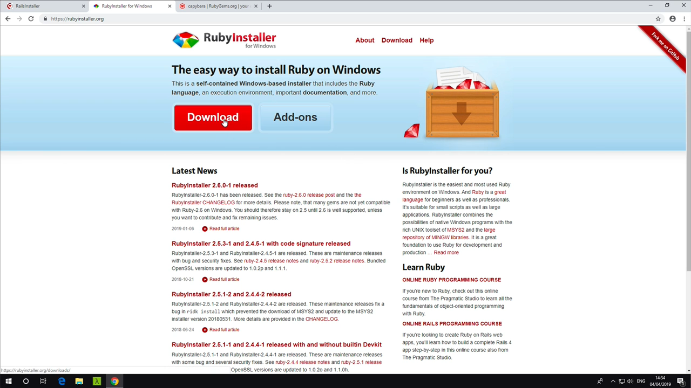

# Instalação do Ruby no Windows

Acesse o site do [Ruby Installer](https://rubyinstaller.org/)

Selecione a versão recomendada, que está marcada com um => antes do nome e versão

Com o instalador baixado, clique duas vezes nele no Windows Explorer e comece a instalar como se fosse qualquer programa, aceitando os termos de uso por exemplo

Garanta que os dois pacotes abaixo estão selecionados para serem instalados

Desmarque o checkbox "Run ridk install" to setup MSYS2 and development toolchain

Abra o prompt de comando ou preferencialmente o Powershell, e digite "ridk install", quando o comando ser executado aperte "3" para selecionar a terceira opção

Quando o instalador perguntar "Which components shall be installed?" apenas digite ENTER e pronto, o Ruby está instalado na sua máquina!

